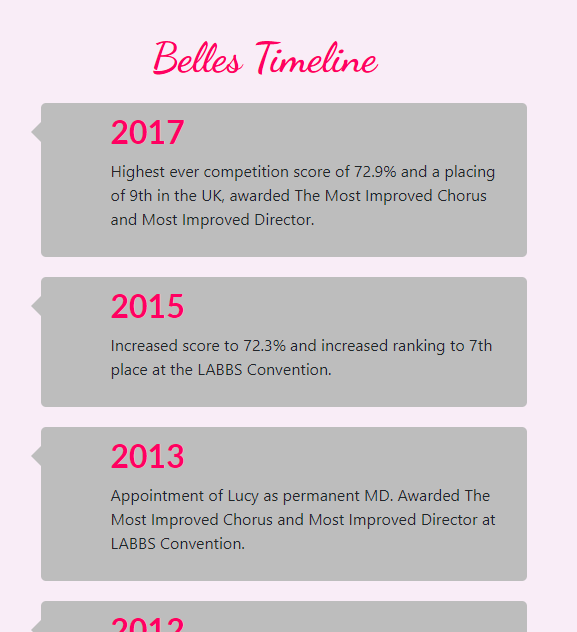
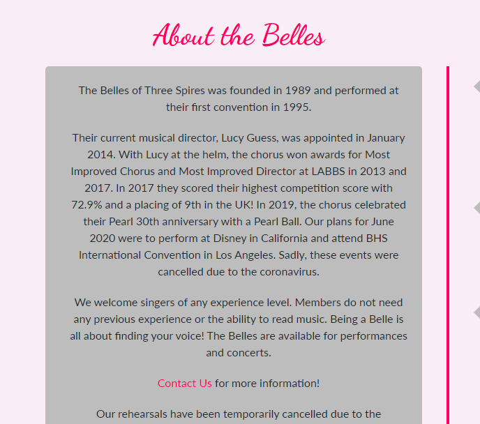
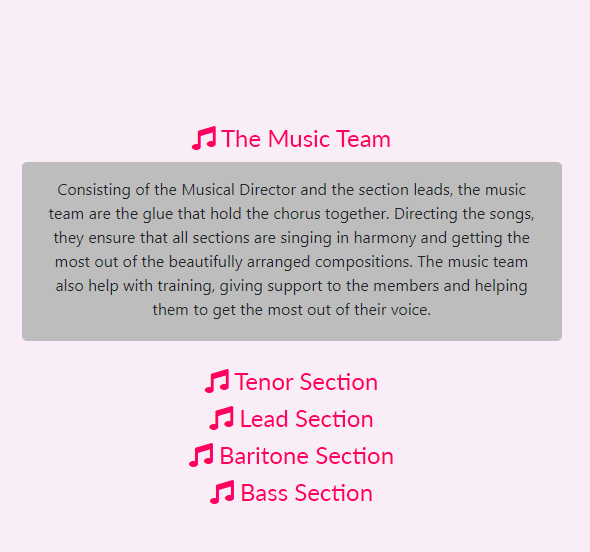

# MS1-belles-of-three-spires

[View the live project](https://rachel2308.github.io/MS1-belles-of-three-spires/index.html)

This website was created to promote the barbershop chorus, The Belles of Three Spires. The main purpose of the site is to inform 
people about the Belles, and about barbershop music in general. Users will also be able to contact the Belles through the 
contact form in order to make a booking or to enquire about booking, and also find their location.

Barbershop music is a stripped back style, with no music or embellishments to suport the vocals. Due to this it was decided that 
the site should follow a similar ethos, a stripped back site which enables the content to be the main feature. This creates a
site that is clean and easy to navigate.

# User Experience (UX)

* **User Stories** 
    * **First Time User Goals**
        1. As a first time user, I will want to know about the Belles and their history.
        2. As a first time user, I may not know about the barbershop style and will want to learn more.
        3. As a first time user, I will want to look them up on social media to get to know more about them.

    * **Returning User Goals**
        1. As a returning user, I will want to keep updated with what the Belles are doing.
        2. As a returning user, I may want to contact the Belles.
    
    * **Frequent User Goals**
        1. As a frequent user, I will want to find out where the Belles are located in order to visit.
        2. As a frequent user, I will want to listen to them and see their latest performances.

# Design

## Colour Scheme

The main colours chosen for the site are hot pink and charcoal grey.

The Belles singout outfit consists of a fleece jacket in a similar colour to that used on the site. As the hot pink
is a bright and modern colour, I have paired it with the classic dark grey of the header, footer and text boxes. As well as being 
aesthetically pleasing and easy to read with a good contrast, the combination of modern and classic also mirrors the 
Belles' performance style. The body of the site has a very pale grey/pink background colour. This ties the two main colours together
as well as making the site more comfortable to navigate.   

The charcoal grey of the header and footer is also used throughout the body of the site in text boxes. 

## Typography

There are two main fonts used in the site. Dancing script, with a backup of the cursive font is used for "The Belles of 
Three Spires" and also for the headers. This font matches font that is used for the Belles on their marketing 
material. All other text uses the lato font, with the backup font of sans serif. This is a clean and easy to read font 
which fits in with the simple style of the site and also contracts nicely with the script of the headers.

## Wireframes

The wireframes for the site were created in balsamiq and uploaded as a pdf. They can be found [here.](assets/documentation/belles-wireframe.pdf)

---

# Features

## Existing Features

The site is responsive across all screen sizes. The layout of the pages change depending on the size of screen, with some features 
disappearing in smaller screen sizes. This has created a tidy and clean look on all screens.

## 1. Featured timeline

The timeline allows users to engage with the site, enabling them to see the Belle's history and accolades

## 2. About the Belles

The about the Belles section will give important information about the Belles, building on the timeline and helping the 
user engage with the site.

## 3. YouTube Video

The inclusion of a YouTube video enables the user to see the Belles performances. The embedded video means the user 
will stay on the site for longer. This serves 2 purposes, firstly it is beneficial for the site's SEO, and also 
having the video on the page means that the user is more likely to continue to engage with the site rather than 
looking at other YouTube videos.

The embedded video did not work as well on smaller screens, so I made the decision to change the video to a link 
to optimise the user experience.

## 4. Accordion

I have added an accordion in order to give details of the different parts of a barbershop chorus. This helps to 
explain this not so well-known musical style and creates interest.

Having the information given as an accordion means that people will interact more with the site, and also saves
screen space which helps user experience on smaller screens. 

## 5. Gallery

A gallery helps the users get to know the Belles and will make them more likely to book them or want to join. It will 
also help to keep the user on the site for longer, increasing SEO. 

The gallery changes depending on screen size, with 3 columns on large screen, 2 on medium and a single column on 
the smaller screen sizes. On hover, the images increase in size, making the page more interactive.

## 6. Contact form

The contact form allows users to make contact with the Belles, and they can also specify the reason for their contact 
in the dropdown box. 

The contact form is optimised for screen size with the percentage width increasing as the screen size decreases. 

## 7. Google Maps Embedded Maps

As well as including an address for the Belles, I have also included an embedded map. On mobile I have changed this 
to a link to Google Maps as the embedded map did not work well on smaller screens.

## 8. Social Media Links

Including the links to the Belles' social media pages increasing the user engagement with the chorus and allows them
to keep up to date with their news.

## Features Left To Implement

## 1. Reviews

A review section could help to increase booking enquiries for the chorus.

## 2. Sticky Navbar

The addition of a sticky navbar would help to make the site more user friendly.

## 3. Calendar

Including a calendar of the Belle's performances will help to increase attendance, and subsequently help to 
increase future bookings.

Frameworks, Libraries & Programs Used
Bootstrap 4.4.1:
Bootstrap was used to assist with the responsiveness and styling of the website.
Hover.css:
Hover.css was used on the Social Media icons in the footer to add the float transition while being hovered over.
Google Fonts:
Google fonts were used to import the 'Titillium Web' font into the style.css file which is used on all pages throughout the project.
Font Awesome:
Font Awesome was used on all pages throughout the website to add icons for aesthetic and UX purposes.
jQuery:
jQuery came with Bootstrap to make the navbar responsive but was also used for the smooth scroll function in JavaScript.
Git
Git was used for version control by utilizing the Gitpod terminal to commit to Git and Push to GitHub.
GitHub:
GitHub is used to store the projects code after being pushed from Git.
Photoshop:
Photoshop was used to create the logo, resizing images and editing photos for the website.
Balsamiq:
Balsamiq was used to create the wireframes during the design process.

